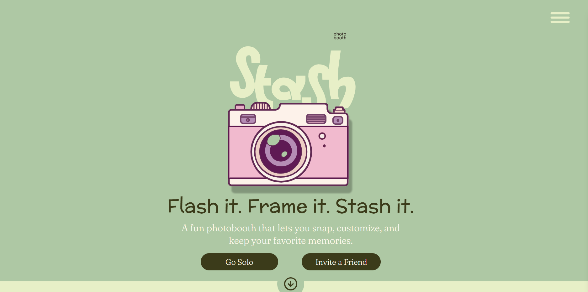
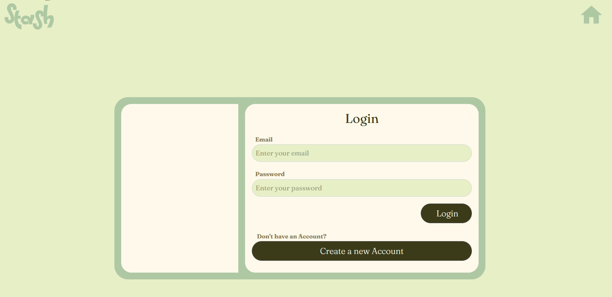
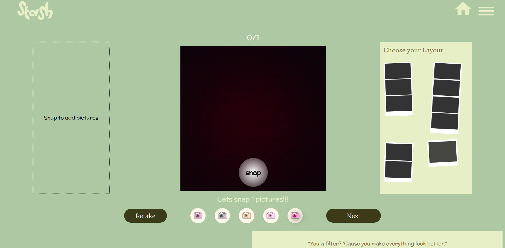
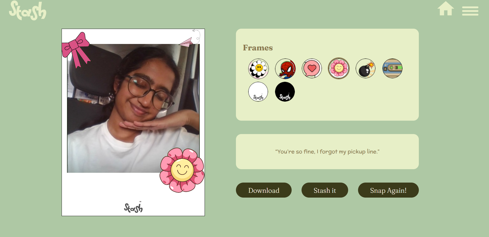
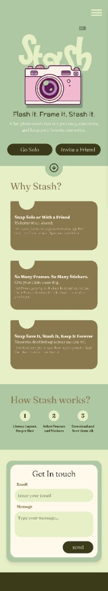
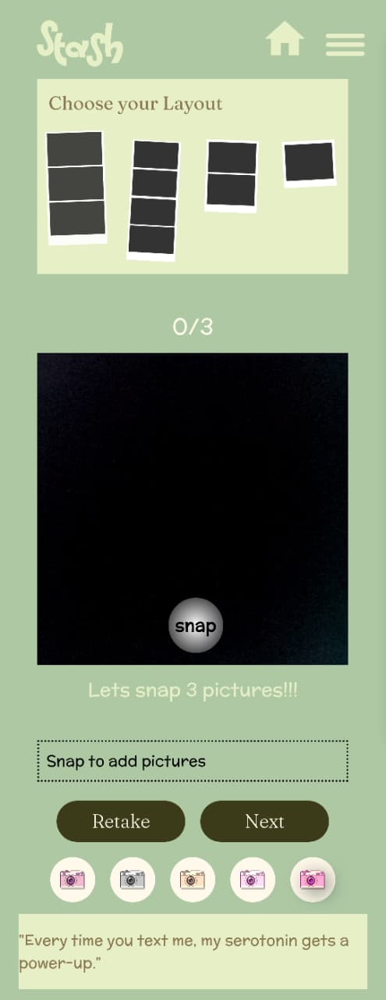
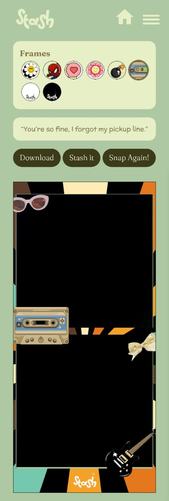

# Stash 📸

**Stash** is a responsive virtual photobooth web app built with React. It lets users snap photos, apply frames and filters, and download their memories. It also includes a Snap with a Friend feature that allows two users to join the same room via a shared link and take photos together in real time.

🔗 **Live Demo:** [https://vismayaskumar.github.io/Stash/](https://vismayaskumar.github.io/Stash/)

---

## 🛠 Tech Stack

* **React** – Component-based UI development
* **Vite** – Fast development server and build tool
* **Tailwind CSS** – Utility-first styling for responsive layouts
* **Firebase Realtime Database** – Real-time syncing for rooms, users, and snapshots
* **react-webcam** – Camera access and image capture
* **React Router** – Client-side routing

---

## ✨ Features

### 📷 Single-user Photobooth

* Live camera preview
* Capture photos directly from the browser
* Clean and intuitive UI

### 🎨 Frames & Filters

* Multiple frame options to enhance photos
* Visual filters for styling snapshots
* Grid-based layout to preview frames and results

### ⬇️ Download Option

* Download captured photos directly to the device

### 🤝 Snap with a Friend (Real-time)

* Create a private room with a unique link
* Share the link to invite another user
* Real-time tracking of users joining the room
* Both users can snap photos simultaneously
* Automatic navigation once both users complete snapping

---

## 🧠 How “Invite a Friend” Works

* A unique room ID is generated for each session
* Firebase Realtime Database tracks:

  * Users joining a room
  * Snapshot data for each user
* When both users have captured a photo, the app automatically moves to a results screen

---

## 👩‍💻 My Role

* Designed the complete UI/UX flow in **Figma**
* Built the frontend using **React** and **Tailwind CSS**
* Implemented real-time room-based functionality using **Firebase Realtime Database**
* Integrated camera access and image capture
* Deployed the project on **GitHub Pages**

---

## 🚀 Run Locally

1. Clone the repository

   ```bash
   git clone https://github.com/VismayaSKumar/Stash.git
   ```
2. Install dependencies

   ```bash
   npm install
   ```
3. Start the development server

   ```bash
   npm run dev
   ```

---

## 📸 Preview










---


* Designed as a frontend-focused project to explore real-time interactions and UI
